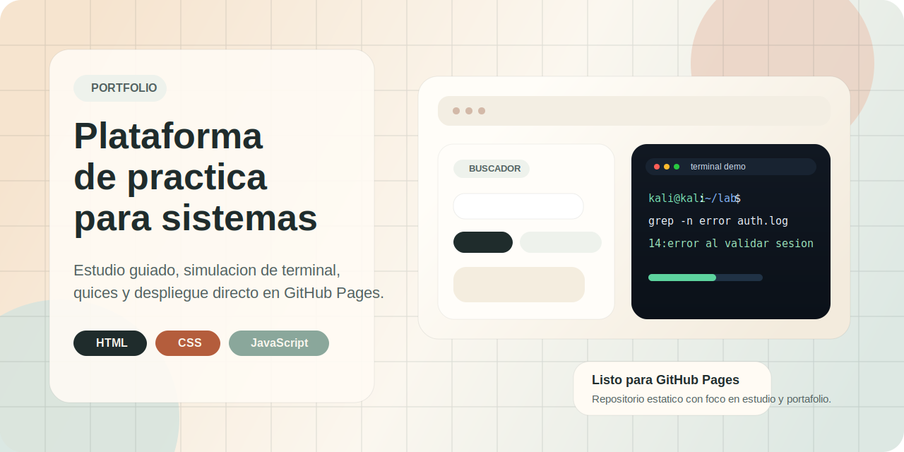
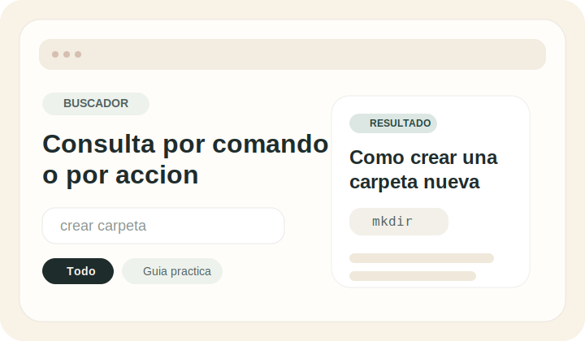
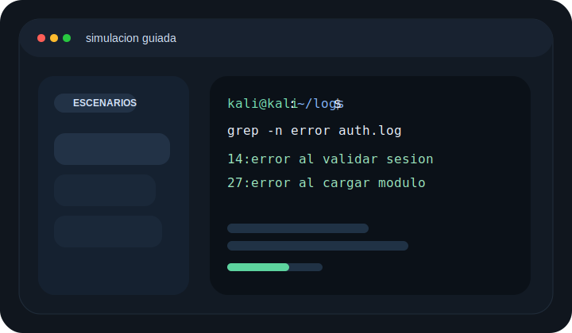
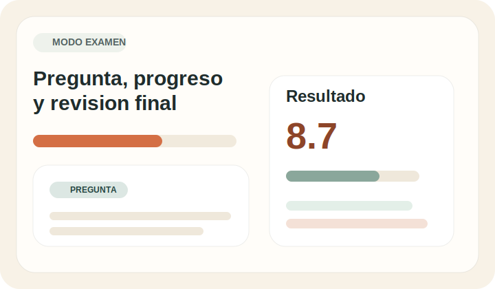

	

## Resumen

Este proyecto transforma contenido academico en una experiencia interactiva de estudio. En lugar de presentar solo documentos planos, organiza teoria, comandos Linux, ejercicios practicos, busqueda contextual y una simulacion de terminal en una unica interfaz web.

El resultado es una pieza apropiada para GitHub y portafolio porque combina trabajo de contenido, diseno de interfaz, logica de interaccion, responsive design y despliegue estatico.

## Demo visual

### Buscador guiado

Consultas por concepto, comando o accion concreta con resultados orientados a estudio y repaso rapido.

### Simulacion de terminal

Escenarios tipo terminal con lectura paso a paso y explicacion dinamica de comandos y salidas.

### Examen y revision

Correccion independiente, nota final y desglose por bloque para medir avance y detectar puntos a reforzar.

### Estado de demo

El proyecto esta preparado para publicarse como sitio estatico en GitHub Pages sin dependencias ni build step.

## Que aporta en un portafolio

- Convierte material fuente en una aplicacion util, no solo en una maqueta visual.
- Demuestra trabajo con HTML, CSS y JavaScript sin frameworks.
- Integra estados de interfaz, renderizado dinamico y logica de evaluacion.
- Muestra criterio de UX para estudio, practica y consulta rapida.
- Incluye adaptacion para telefono y publicacion sencilla en GitHub Pages.

## Funcionalidades principales

- Cuestionario general con mezcla de teoria y comandos.
- Examen separado de comandos del material con nota independiente.
- Buscador por tema, comando o intencion de uso.
- Guias practicas integradas con explicaciones paso a paso.
- Simulacion de terminal con escenarios didacticos.
- Retos practicos con correccion inmediata.
- Interfaz responsive para escritorio y telefono.

## Stack

- HTML para la estructura completa de la aplicacion.
- CSS para identidad visual, layout responsive y componentes.
- JavaScript vanilla para renderizado, busqueda, simulacion y evaluacion.
- GitHub Pages como estrategia de despliegue estatico.

## Estructura del repositorio

- `index.html`: aplicacion principal.
- `assets/`: recursos visuales del README.
- `material/resumen-estudio.txt`: resumen del contenido trabajado.
- `material/transcripcion-material.txt`: transcripcion organizada del material base.
- `material/comandos-linux-practica.docx`: apoyo para comandos Linux.
- `material/semana-5-automatizacion-linux.docx`: apoyo para automatizacion en GNU/Linux.
- `material/material-original.pdf`: documento fuente.
- `material/imagenes/`: imagenes originales utilizadas durante la transcripcion.

## Ejecucion local

No requiere instalacion de dependencias.

1. Clona o descarga el repositorio.
2. Abre `index.html` en tu navegador.
3. Si deseas validar el comportamiento de despliegue, sirve la carpeta desde un hosting estatico simple.

## Publicacion en GitHub Pages

1. Sube este contenido a un repositorio en GitHub.
2. Verifica que `index.html` permanezca en la raiz.
3. En `Settings > Pages`, selecciona `Deploy from a branch`.
4. Elige la rama principal y la carpeta `/ (root)`.
5. Guarda los cambios y espera la publicacion.

## Alcance del contenido

La logica de preguntas, examenes, busqueda guiada y simulacion se ajusto para mantenerse alineada con el material disponible en la carpeta `material/`, especialmente en la seccion de comandos y operadores usados como base del entrenamiento.

## Posibles mejoras futuras

- incorporacion de capturas reales del sitio publicado;
- pagina de creditos o ficha tecnica del proyecto;
- separacion del contenido en modulos o archivos JSON si el banco de preguntas sigue creciendo;
- analitica simple de progreso si se quisiera evolucionar a una version mas completa.